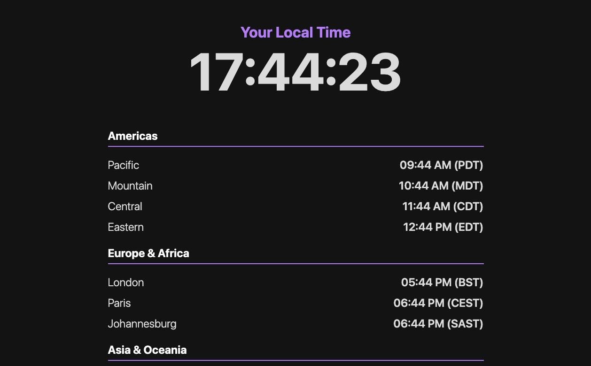

# 🌍 TimeZones

TimeZones is a simple and lightweight Flask web application that provides an at-a-glance view of the current time across multiple international time zones.

 

---

## 🚀 Features

- ✅ **Your Local Time:** Displays your own local time prominently, updating every second.
- ✅ **World Clocks:** Shows the current time for major cities across the Americas, Europe, Africa, Asia, and Oceania.
- ✅ **Live Updates:** All clocks on the page tick in real-time.
- ✅ **Clean Interface:** A straightforward, dark-mode design that is easy to read.

---

## 🛠️ Tech Stack

- Flask
- Python
- HTML / CSS
- Vanilla JavaScript

---

## 🧑‍💻 Getting Started

### 1. Clone the Repository

```bash
git clone https://github.com/daim02/timezones.git
cd timezones
```

### 2. Install Dependencies
```bash
pip install Flask pytz
```

### 3. Run Locally

```bash
python app.py
```

Open your web browser and navigate to `http://127.0.0.1:5000`.

